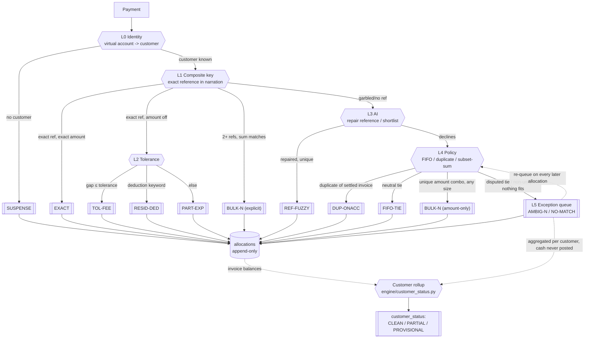

# Tally

**Razorpay Buildathon &middot; Track 04**

An agent that matches incoming bank payments to open invoices, reports a
measured match rate, and refuses to guess when it cannot prove a match.

> Scope: allocation only. Not collections, not forecasting, not dunning.
> See [`PRD (1).md`](<PRD (1).md>) for the full spec this implements.

## Results (current run)

| Metric | Value |
|---|---|
| Match rate vs ground truth | **100.0%** (64/64 payments, all 11 reason codes) |
| Auto-resolution rate | **75.0%** |
| Human touches | **11** (of 16 raw exceptions, grouped) |
| Value requiring review | Rs 3,74,475.00 |
| Precision at default dial (85) | **100.0%** |
| Resolved on re-queue | **2** &mdash; genuinely unresolvable on arrival, closed by a later payment |
| Customer status accuracy | **100.0%** (CLEAN / PARTIAL / PROVISIONAL) |
| Customer balance accuracy | **100.0%** &mdash; including for PROVISIONAL customers |

Industry benchmark for straight-through cash application is roughly
85-95%. This run's auto-resolution rate (75.0%) sits below that band by
design: the synthetic dataset is deliberately adversarial (garbled
references, duplicates, disputed ties, unidentifiable payers) so every
layer of the engine gets exercised. The **confidence threshold curve**
below is the real answer to "where do we actually land" &mdash; it shows
auto-matched vs. human-touches vs. wrong-matches across every dial
setting, not just one.

17 customers hold those 61 invoices (avg 3.6/customer, 12 customers with
3+ simultaneously open) &mdash; not 45 customers each holding ~1, which
made every match in an earlier version of this dataset structurally
trivial and starved the hard cases (`AMBIG-N`, `FIFO-TIE`, `PROVISIONAL`)
of the multi-invoice conditions that actually create them.

The "resolved on re-queue" row is the re-queue rule proven in the
**actual submission run**, not only in `tests/test_requeue.py`'s
standalone scenario: two `resolution_group` sequences are planted in
`engine/generate_data.py` where an early payment is genuinely `AMBIG-N`
on arrival (three financially-identical open invoices, no unique pair)
and a later payment in the same batch closes the tie, so the re-queue
loop resolves the first one without anyone touching it again.

The last two rows are the other half of the argument. A handful of
customers in this dataset get payments that never individually match any
invoice, so every one of those payments is correctly `NO-MATCH` &mdash;
that's not a failure, it's a refusal to guess. But their **balance** is
still provable by arithmetic (invoiced minus received), independent of
which invoice it will eventually settle. See "Two-tier report" below and
in the dashboard.

Full dashboard: run `python -m report.generate_report` and open
[`report/report.html`](report/report.html), or see `out/results.json`
for the raw numbers (reason-code breakdown, exception queue, full
threshold curve, customer-status accuracy).

### Held-out validation

A 100% match rate against `ground_truth.csv` alone is a tautology: the
data was built to the same 12-code spec the engine is written against.
`engine/generate_data.py --mode holdout` builds a second, six-payment
dataset out of inputs that spec never enumerated &mdash; a phantom
invoice reference, a 2x overpayment, near-identical payer names, a
refund, a payment predating its own invoice's issue date, and a
narration naming two conflicting invoices &mdash; scored separately.

| Metric | Submission | Holdout |
|---|---|---|
| Match rate | **100.0%** | **66.7%** |
| Auto-resolution rate | 75.0% | 66.7% |

Four of six holdout categories pass outright (two because of engine
fixes made alongside this dataset: a single reason code on an
overpayment, and refusing non-positive amounts rather than corrupting an
invoice balance). Two are **documented misses** &mdash; the engine has no
temporal check and no conflicting-reference check, so it confidently
returns the wrong answer. `out/results_holdout.json`'s `mismatches` field
(and the dashboard's "Held-out validation" section) explains both.

```bash
python -m engine.generate_data --mode holdout
python -m engine.run_engine --suffix _holdout
python -m scoring.score --suffix _holdout
python -m scoring.compare      # side-by-side table + explained mismatches
```

## Architecture



Deterministic rules (L0, L1, L2, L4, L5) handle every payment where the
proof is exact. The AI layer (L3) is called only on the tail &mdash;
garbled references and shortlist ties &mdash; is given a closed shortlist
it must choose from, and is explicitly allowed to answer "I don't know."
Confidence is **computed from countable signals** (`engine/confidence.py`),
never taken from the model's self-report.

**A unique covering combination is always `BULK-N`,** even when it happens
to be every open invoice a customer has, and even when those invoices
share an amount: every invoice in the combination reaches zero balance
either way, so there's no attribution left to assume. That case is fully
determined, not provisional.

A customer-level rollup (L6, `engine/customer_status.py`) runs after the
payment-level pipeline and answers a different question: not "what
happened to this payment" but "how much of this customer's picture is
provable." See **Two-tier report** below.

## Reason codes

| Code | Meaning |
|---|---|
| `EXACT` | Reference and amount both agree |
| `TOL-FEE` | Shortfall inside tolerance; difference written off to bank charges |
| `PART-EXP` | Partial payment; more expected; invoice stays open |
| `RESID-DED` | Short-pay treated as a deduction; invoice cleared, residual raised |
| `BULK-N` | One payment covering N invoices (explicit reference or unique amount subset-sum) |
| `REF-FUZZY` | Reference repaired (typo, truncation, casing, dropped separator) |
| `FIFO-TIE` | Candidates financially identical and undisputed; policy applied |
| `DUP-ONACC` | Duplicate payment; parked as customer advance |
| `SUSPENSE` | Payer unidentifiable (virtual account maps to no customer) |
| `AMBIG-N` | Payer known, N candidates, none decidable (e.g. a disputed tie) |
| `NO-MATCH` | Payer known, nothing fits |

`SUSPENSE` and `NO-MATCH` are different failures: one is "who?", the
other is "which?".

Note what's *not* in this table: `PROVISIONAL` is deliberately not a
payment-level code. It answers a different question than the other
eleven ("how sure are we of this customer's invoice split?" rather than
"what happened to this payment?"), so it lives one level up &mdash; see
below.

## Two-tier report: customer status

Every payment still exits with exactly one of the eleven codes above.
Separately, after the payment-level pipeline runs, each **customer** gets
rolled up (`engine/customer_status.py`) into one of three states:

| Status | Meaning |
|---|---|
| `CLEAN` | Open ledger balance is zero |
| `PARTIAL` | Balance &gt; 0, but fully explained by real invoice-level matches |
| `PROVISIONAL` | Balance &gt; 0 **and** some received cash was never tied to a specific invoice (`AMBIG-N` / `NO-MATCH` payments) |

The arithmetic:

```
open_balance_ledger = sum of each invoice's (amount - allocations posted to it)
unmatched_cash      = sum of AMBIG-N / NO-MATCH payment amounts for that customer
balance              = max(0, open_balance_ledger - unmatched_cash)
```

`balance` is provable by subtraction, regardless of whether any single
payment resolved. A customer can be `PROVISIONAL` &mdash; certain balance,
unproven split &mdash; while every one of their payments is individually,
correctly, `NO-MATCH`. That's not a contradiction; it's the whole point of
reporting at two levels instead of one. The dashboard's "assumed split"
for a `PROVISIONAL` customer is a FIFO waterfall suggestion for display
only (`engine/l4_policy.py:waterfall_split`) &mdash; it is never written to
the `allocations` ledger, because it isn't proven.

`ground_truth_customers.csv` (alongside `ground_truth.csv`) carries the
expected status and balance per customer, computed the same way from
construction intent, not by running the engine &mdash; and scored the same
way (`engine/customer_status.rollup`) whether the input is the
generator's intent or the engine's actual output, so the two definitions
of "provisional" can't drift apart.

## Project layout

```
engine/             deterministic engine + AI layer (Phases 1-3)
  generate_data.py    synthetic data generator + ground truth (Phase 1);
                        --mode submission (default, 64 payments/61 invoices/
                        17 customers) or --mode holdout (6 messy, off-spec
                        cases, see "Held-out validation" above)
  schema.sql, db.py   SQLite schema (paise-integer money, append-only allocations)
  l0_identity.py      L0: virtual account -> customer
  l1_composite.py     L1: exact reference matching (single + explicit multi)
  reference.py        token extraction, normalization, fuzzy repair
  l2_tolerance.py      L2: tolerance band + deduction-keyword detection
  l3_ai.py, ai_client.py  L3: Claude API (claude-opus-5) with a deterministic
                        stub fallback -- same interface either way
  l4_policy.py        L4: FIFO tie-break, subset-sum search, waterfall split
  l5_exceptions.py    L5: exception queue grouping + ranking by value;
                        human_touch_groups() -- shared by scoring/score.py
                        and the simulator so "human touches" can't drift
  l6_action.py         L6: proposed next action per exception (simulator only)
  pipeline.py         orchestrator: forward pass + re-queue fixed-point loop
  customer_status.py  L6: customer-level rollup (CLEAN/PARTIAL/PROVISIONAL)
  run_engine.py        entry point; --suffix _holdout for the holdout db
scoring/
  score.py             Phase 4: payment match rate + customer status/balance
                         accuracy, human touches, threshold curve; --suffix _holdout
  compare.py           submission vs. holdout side-by-side + explained mismatches
report/generate_report.py   Phase 5: static HTML dashboard (no Next.js/build step);
                       renders a "Held-out validation" section when
                       out/results_holdout.json exists
simulator/           interactive decision-trace demo (FastAPI + vanilla JS) --
                       same engine.pipeline.resolve_payment() call as batch mode;
                       run with `python -m simulator`. /app is an arrival
                       screen ("64 payments received from Razorpay") that,
                       on "Process these payments", steps through the real
                       64-payment submission dataset one payment at a time
                       -- 13 of the 64 reordered to the front and narrated
                       (see batch_seed.py), the remaining 51 shown at full
                       technical trace detail. Charts and a "summary by
                       case type" table stay hidden until all 64 have run.
                       /story is the separate 13-payment KFG Snacks Store
                       walkthrough described below. The Live Razorpay lane
                       (webhook + real test-mode payments) still runs
                       server-side -- see "Live Razorpay lane" below --
                       it just has no tab in /app any more
  batch_seed.py        the 13 real submission payments (by payment_id)
                       reordered to the front of /app's walkthrough, plus
                       their narration. Presentation only -- the reorder
                       never changes a reason code; verified by running
                       the real engine both ways in
                       tests/test_batch_reorder.py
  live_seed.py, webhook.py   the Live world's seed data and the pure
                       signature-verification/payload-mapping functions
                       behind POST /webhook/razorpay (see "Live Razorpay
                       lane" below)
  story_seed.py        the Story world: a fixed 13-payment day at "KFG
                       Snacks Store" at /story. A single-screen walkthrough
                       (1920x1080, no scrolling) in plain English for a
                       short screen recording. The whole day is played
                       through the real engine once at start-up and frozen
                       into 14 frames; Next / Previous / clicking a payment
                       / arrow keys just navigate those frames (never
                       re-run the engine), so every panel shows the state
                       as it was AT THAT POINT. Left: the 13 payments;
                       centre: the current one, verdict badge first, then
                       how it decided; right: 1 sorted / 2 not sorted /
                       3 what we're doing (with the drafted customer
                       message). Plus a By-hand vs With-the-app toggle.
                       Every outcome verified against the real engine by
                       tests/test_story_world.py, not asserted by hand
scripts/create_payment_link.py   creates a Razorpay test-mode Payment
                       Link for a seeded Live invoice
tests/               pytest: reference repair, customer-status rollup,
  accounting-integrity (CASH vs ADJUSTMENT), the re-queue mechanism (both
  a standalone scenario and the submission run itself), end-to-end
  regression guard, holdout-scores-lower-than-submission guard
out/                 generated: finance(_holdout).db, ground_truth(_holdout).csv,
                       ground_truth_customers(_holdout).csv, results(_holdout).json
```

## Running it

```bash
pip install -r requirements.txt

python -m engine.generate_data      # Phase 1: 64 payments, 61 invoices, ground truth
python -m engine.run_engine         # Phase 2/3: deterministic engine + AI layer
python -m scoring.score             # Phase 4: match rate, human touches, threshold curve
python -m report.generate_report    # Phase 5: report/report.html

python -m pytest tests/ -v

# Held-out validation (see above)
python -m engine.generate_data --mode holdout
python -m engine.run_engine --suffix _holdout
python -m scoring.score --suffix _holdout
python -m scoring.compare

# Interactive simulator (decision trace, play mode, actions, before/after toggle)
python -m simulator      # http://127.0.0.1:8000  (Story world at /story)

# Live Razorpay lane (optional, needs .env -- see "Live Razorpay lane" below)
python -m scripts.create_payment_link
```

The AI layer runs against a real model when credentials are present, and
falls back to a deterministic heuristic otherwise -- reference
normalization/fuzzy-match for repair, and a "never override a dispute"
rule for shortlist choice. Both paths are held to the same contract:
return an answer or return `None`, never a guess. A transient API error
also falls back to the stub rather than crashing the pipeline.

Provider is configured via `.env` (see `engine/ai_client.py`), never
hardcoded:

```
LLM_PROVIDER=anthropic   # anthropic | openai | xai
LLM_API_KEY=sk-...
LLM_MODEL=claude-opus-5  # required for openai/xai; defaults for anthropic
```

xAI's API is OpenAI-compatible (same request shape), so both go through
the `openai` SDK, xai only overriding the base URL. Legacy
`ANTHROPIC_API_KEY` / `ANTHROPIC_AUTH_TOKEN` still work with no other
config, for anyone who already had those set. With nothing configured,
every AI-backed call site (L3 reference repair/shortlist, L6 action
drafting, Ask the Ledger, Explain this refusal) runs its stub instead --
this is the state the committed `out/results*.json` were scored in.

## Live Razorpay lane

A third world in the simulator, alongside Demo and Batch: real Razorpay
test-mode payments, verified and routed through the exact same
`resolve_payment()` as everything else. Hidden entirely (no tab, and
`POST /webhook/razorpay` 404s) unless all three of `RAZORPAY_KEY_ID`,
`RAZORPAY_KEY_SECRET`, `RAZORPAY_WEBHOOK_SECRET` are set in `.env` --
the repo runs normally with none of this configured.

**1. Test-mode keys.** Sign up at [razorpay.com](https://razorpay.com),
switch to **Test Mode**, and grab `Key ID` / `Key Secret` from
Settings -> API Keys. Put them in `.env`:

```
RAZORPAY_KEY_ID=rzp_test_...
RAZORPAY_KEY_SECRET=...
```

**2. A public URL for the webhook.** Razorpay needs to reach your local
server, so tunnel port 8000 with a Cloudflare quick tunnel -- no account,
no signup, and the binary comes straight from Cloudflare (antivirus
tends to leave it alone, unlike the ngrok download).

Install once (Windows):

```powershell
winget install --id Cloudflare.cloudflared
```

winget installs to `C:\Program Files (x86)\cloudflared\cloudflared.exe`
but usually does **not** add it to PATH. Copy the exe into the project
folder so `.\cloudflared` just works:

```powershell
Copy-Item "C:\Program Files (x86)\cloudflared\cloudflared.exe" -Destination E:\razorpay\cloudflared.exe
.\cloudflared --version
```

Start your app first (`python -m simulator`, in its own window), then
in a second window run the tunnel:

```powershell
.\cloudflared tunnel --url http://localhost:8000 --no-autoupdate
```

It prints a line like:

```
https://<random-words>.trycloudflare.com
```

Leave that window open -- the URL is live only while the command runs,
and you get a fresh random URL every restart (so re-register the webhook
in Razorpay each time you restart the tunnel).

**3. Register the webhook.** In the Razorpay dashboard: Settings ->
Webhooks -> Add New Webhook.
- URL: `https://<random-words>.trycloudflare.com/webhook/razorpay`
- Active events: `payment.captured` (and/or `payment_link.paid`)
- Set a secret, and put the same value in `.env`:

```
RAZORPAY_WEBHOOK_SECRET=whsec_...
```

**4. Run it.**

```bash
python -m simulator                                        # http://127.0.0.1:8000/app
python -m scripts.create_payment_link                       # link for LIVE-INV-01's exact amount
python -m scripts.create_payment_link --invoice LIVE-INV-03 # a different seeded invoice
python -m scripts.create_payment_link --invoice LIVE-INV-02 --amount 12000
                                                           # ad-hoc amount, no invoice_id -> NO-MATCH
```

Open the printed URL, complete a test checkout (Razorpay's test cards/UPI
are documented in their test-mode docs), and check `GET /live/state`
(no tab in /app shows this any more, but the endpoint still runs and
updates live). The payment link's `notes` (virtual_account / invoice_id / payer_name, see
`scripts/create_payment_link.py`) are what let `simulator/webhook.py` map
the payload back to one of `simulator/live_seed.py`'s four seeded
invoices, since Payment Links have no bank-narration equivalent of their
own.

`--amount RUPEES` overrides the link amount and drops `invoice_id` from
`notes` -- the link is then for an arbitrary sum, not a specific bill.
`--invoice` still selects *whose* payment it is (via virtual_account /
payer_name). Pay `--invoice LIVE-INV-02 --amount 12000` and the engine
identifies Test Buyer One but finds no open invoice at Rs 12,000 and no
combination that sums to it, so the payment is parked in the exception
queue as **NO-MATCH** rather than guessed at -- the "refuses to guess"
case, visible in `GET /live/state`.

Every webhook delivery -- valid, invalid, or a Razorpay retry of one
already processed -- is logged to `out/live_webhook_log.jsonl` for
tracing. Deliveries are idempotent on Razorpay's payment id, and the
signature (`X-Razorpay-Signature`, HMAC-SHA256 over the raw request body)
is checked before any JSON parsing; an unsigned or mis-signed request
gets a 400, never processed.

## Design principle

> The AI never touches money it can verify. It only reasons about the tail.

- Money is always integer paise, never floats.
- `allocations` is append-only. A resolution is written to the ledger
  only once it is final (resolved or permanently parked) -- nothing is
  superseded or edited.
- Confidence is computed by the engine from reference/amount/candidate
  signals (`engine/confidence.py`), not asked of the model.
- The confidence auto-post threshold is a dial the finance team controls
  (default 85), separate from whether a payment resolved at all.

## Prior art

| Source | Idea taken |
|---|---|
| SAP S/4HANA | Tolerance groups; partial vs. residual item; reason codes |
| US healthcare X12 835 | Standardized reason-code vocabulary; payments/claims as many-to-many |
| Securities reconciliation | Composite match keys; typed breaks routed by type; never force-match |
| Telecom revenue assurance | Continuous reconciliation; prioritize by financial impact |
| Cash-application vendors | Configurable auto-clear threshold; append-only audit record |

## Out of scope

Collections, dunning, forecasting, multi-currency, OCR of remittance
PDFs, live Razorpay API integration, authentication, multi-tenant.
